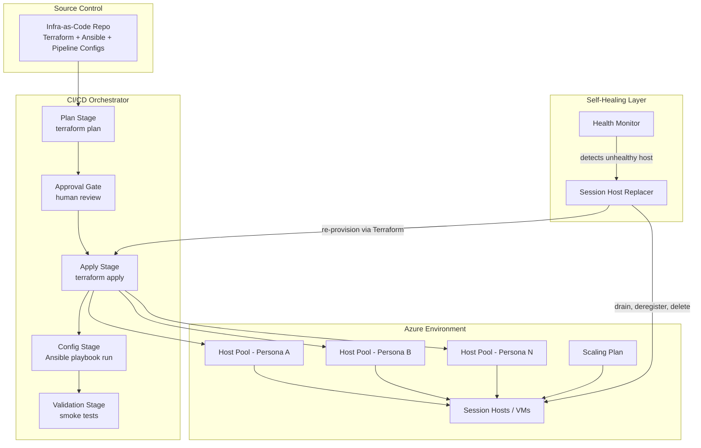

# Enterprise VDI Automation Platform (Portfolio Showcase)

> **Note:** This repository is a *generic, from-scratch recreation* of the architecture
> and automation patterns I designed and operated for a large-scale enterprise
> Azure Virtual Desktop (AVD) environment. All code here is illustrative/synthetic —
> written to demonstrate the design, not copied from any employer's proprietary
> codebase. No company names, hostnames, credentials, or internal identifiers are
> included.

## What this project demonstrates

I built and operated the automation backbone for a multi-tenant Azure Virtual
Desktop platform spanning **2 Azure regions**, running **50 host pools**
("personas") and delivering **500+ applications** to end users. I wrote the
Terraform, the Ansible playbooks, the self-healing automation, and the pipeline
glue myself, and was the hands-on engineer for the full lifecycle:
**provision → configure → validate → heal → scale**.

**Hands-on work demonstrated here:**
- Wrote Terraform modules for repeatable, auditable Azure provisioning across
  2 regions and 50 host pools, published from a separate, versioned module
  repo and consumed by every persona's thin deployment repo via a pinned ref
- Authored Ansible playbooks delivering and maintaining 500+ applications
  across the fleet, wrapped in a reusable host-pool wrapper pattern
- Built a zero-downtime, image-drift-triggered rolling session-host
  replacer from scratch (a capability not natively offered by Azure's own
  AVD control plane)
- Wired up CI/CD pipeline stages for infra changes (plan → approve → apply)
- Built an AI agent that sits in front of the pipeline to plan, gate, and
  monitor deployment requests end-to-end
- Implemented the multi-tenant "persona" config pattern used to onboard new
  business units without new engineering work
- Debugged and fixed production issues: state locks, IP/subnet exhaustion, VM
  extension conflicts, scaling-plan misconfiguration

## High-Level Architecture



## Repository Layout

```
AVD-Automation-Portfolio/
├── README.md                              <- you are here
├── docs/
│   ├── 01-architecture-overview.md        <- system design & design decisions
│   ├── 02-terraform-provisioning-flow.md  <- IaC provisioning flow
│   ├── 03-session-host-replacer-flow.md   <- zero-downtime image rollout + self-healing
│   ├── 04-ansible-configuration-flow.md   <- config management flow + scaling-plan rationale
│   ├── 05-cicd-orchestration-flow.md      <- pipeline orchestration flow
│   ├── 06-ai-deployment-agent.md          <- AI agent that drives the pipeline
│   └── 07-terraform-module-repo-pattern.md <- shared modules repo, pinned by ref
├── sample-code/
│   ├── terraform/                         <- "deployment repo": thin, calls modules by pinned ref
│   │   └── environments/pilot|prod/           <- nested per-environment, per-persona tfvars
│   ├── terraform-modules-repo/            <- "module repo": networking, host-pool, workspace,
│   │                                          session-hosts, private-endpoint, scaling-plan
│   ├── ansible/                           <- task playbook + host-pool wrapper
│   ├── session-host-replacer/             <- rolling-upgrade + unhealthy-host replace loops
│   └── ai-agent/                          <- tool-calling deployment agent skeleton
└── linkedin/
    ├── linkedin_post_short.md
    ├── linkedin_post_long.md
    └── resume_bullet_points.md
```

## Why I built it this way

Running 50 host pools across 2 regions with 500+ applications by hand doesn't
scale — and enterprise VDI has a few recurring failure modes I hit personally:
session hosts silently go unhealthy, Terraform state locks orphan after
interrupted runs, subnets run out of IPs during bursty scale-out, and
onboarding a new business unit ("persona") by hand eats real engineering time.
The choices in this code — declarative IaC, an explicit approval gate before
any `apply`, an idempotent persona pattern, and an automated replacer loop
instead of manual VM babysitting — were direct fixes for problems I ran into
and debugged myself.

See `docs/` for a deeper walkthrough of each flow.
