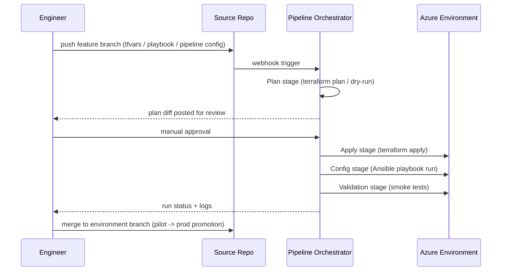

# Flow: CI/CD Pipeline Orchestration

**Goal:** Give every infrastructure or configuration change a consistent,
auditable path from "proposed" to "live," with a human approval gate before
anything touches production.

## Pipeline stages

## Design choices

- **Plan/apply separation** — nothing applies without an explicit,
  reviewable plan step first. This is the single biggest guardrail against
  accidental destructive changes.
- **Interactive trigger forms** for operational flows (e.g. "run this
  playbook against this host pool") — reduces the chance of fat-fingering a
  target environment, since the operator picks from validated dropdowns
  (environment, persona, host pool, playbook) rather than typing free text.
- **Repo cache refresh as an explicit step** — the orchestrator caches repo
  content for speed; a stale cache after a merge is a common enough
  "why isn't my change showing up" issue that a refresh step is built into
  every runbook rather than left as tribal knowledge.
- **Environment promotion, not environment duplication** — pilot isn't a
  throwaway sandbox; it's the mandatory gate every production change passes
  through, using the exact same automation code path (no "prod-only" script
  forks that silently drift from what was tested).

## Common failure modes handled

- **Orphaned process state** when a run is cancelled mid-apply (e.g. a
  SIGTERM) — documented recovery runbook rather than ad-hoc fixes each time.
- **"No onPush flow found"** style errors — when a webhook trigger is
  configured but no matching automated flow exists for a given repo/branch
  combination; resolved by explicit flow-to-branch mapping documentation.
