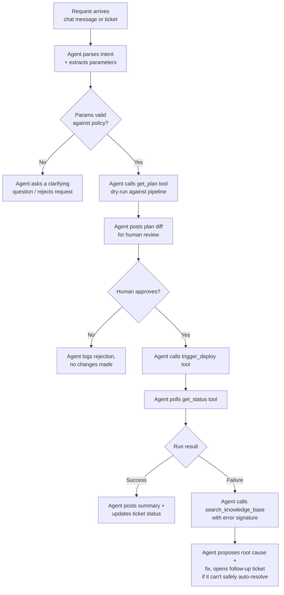

# AI Deployment Agent -- Orchestrating Infrastructure Changes

**Goal:** Let an engineer or operator request an infrastructure/config
change in plain language or via a ticket, and have an AI agent plan,
validate, execute, monitor, and report on it -- with a human approval gate
before anything destructive happens.

This sits *in front of* the CI/CD pipeline described in doc 05 -- it doesn't
replace the plan/approve/apply model, it drives it, and adds a
troubleshooting/reporting layer on top.

## Why build this

The pipeline itself (Terraform + Ansible + orchestrator) is powerful but
still requires someone to know: which repo, which persona config, which
pipeline entry point, how to read a plan diff, how to interpret a failure
log, and where to update the tracking ticket once it's done. That's a lot of
tribal knowledge for a routine request like "add 2 more session hosts to
persona X" or "roll out the latest image to persona Y." The agent's job is
to absorb that tribal knowledge so the *request* stays simple, while the
*guardrails* (approval gates, audit logging, no-blind-retries-on-destructive-
ops) stay exactly as strict as the underlying pipeline already enforces.

## Workflow

## Tools exposed to the agent

The agent doesn't have raw shell/API access baked into its prompt -- it has
a fixed set of callable tools, each independently auditable:

| Tool | Purpose | Notes |
|---|---|---|
| `get_plan` | Run a dry-run (`terraform plan` equivalent) for a proposed change | Read-only, always safe to call |
| `trigger_deploy` | Kick off the actual pipeline run | Only callable after an explicit human approval step |
| `get_status` | Poll a running/completed pipeline execution | Read-only |
| `query_deployment_history` | Look up past runs for a persona/environment | Read-only, used for context ("has this failed before?") |
| `search_knowledge_base` | Semantic search over past incidents/learnings | Used automatically on failure to suggest root cause |
| `create_ticket` / `update_ticket` | Track the request lifecycle | Every state transition is logged here, not just in chat |
| `post_chat_notification` | Notify a channel/thread of status changes | Keeps humans in the loop without polling |

## Guardrails

- **No destructive action without an explicit approval step.** `trigger_deploy`
  is simply not callable until a plan has been shown and approved -- this is
  enforced by the tool-calling contract, not just prompt instructions.
- **Every tool call is logged**, independent of whatever the agent's final
  natural-language summary says -- the audit trail doesn't depend on the
  agent describing itself accurately.
- **Read-only tools are always available**; state-changing tools are gated.
  This means the agent can always answer "what would happen if..." questions
  without any approval overhead.
- **On failure, the agent proposes -- it doesn't self-heal blindly.** If a
  known-issue match is found (e.g. a documented state-lock or subnet
  exhaustion pattern), it suggests the fix and either asks for approval to
  apply it or opens a follow-up ticket. It does not retry destructive
  operations automatically.

## Generic example

See `sample-code/ai-agent/deployment_agent.py` for an illustrative,
non-proprietary skeleton showing the tool-registration and control-loop
pattern described above (not a working LLM integration -- just the
architecture).
