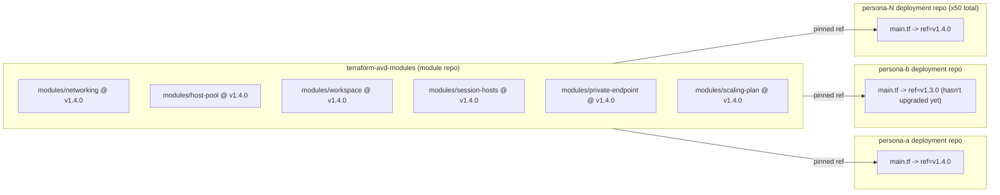

# Flow: Terraform Module Repository Pattern

**Goal:** Ship shared infrastructure logic once, from one repo, and let
every one of the 50 persona deployment repos consume a specific, pinned
version of it -- instead of copy-pasting the same `.tf` resource blocks
into every persona's config.

## The two repos

| Repo | Contains | Changes how often | Reviewed by |
|---|---|---|---|
| **terraform-avd-modules** (module repo) | Reusable modules: `networking`, `host-pool`, `workspace`, `session-hosts`, `private-endpoint`, `scaling-plan` | Whenever shared logic needs a fix/feature | Platform/infra owners |
| **persona deployment repo** (one per persona, x50) | A thin `main.tf` wiring all six modules together + nested `environments/<env>/<persona>.tfvars` | Rarely, mostly just variable value + `ref` bumps | Persona/business-unit owner + platform review |

## How the call works

```hcl
module "host_pool" {
  source = "git::https://github.com/example-org/terraform-avd-modules.git//modules/host-pool?ref=v1.4.0"
  persona_name = var.persona_name
  location     = var.location
}
```

- `git::https://...` tells Terraform to fetch the module from a git
  repository rather than a local path or registry.
- `//modules/host-pool` is the subdirectory inside that repo (a single
  module repo hosts multiple modules).
- `?ref=v1.4.0` pins the exact commit/tag. **This is the whole point** --
  without it, every deployment repo would silently pick up the module
  repo's latest commit on every `plan`, which is exactly the kind of
  "invisible drift" this pattern exists to prevent.

## Why split it out at all

- **Fix once, ship everywhere (on each consumer's own schedule).** A bug
  in the session-host extension version gets fixed in one PR to the module
  repo. Each of the 50 deployment repos picks it up by bumping its own
  `ref` -- not by a platform engineer hand-editing 50 files.
- **Independent review boundaries.** Changes to shared module logic go
  through platform-team review (higher bar, affects everyone eventually).
  Changes to a single persona's `.tfvars` (e.g. "add 2 more hosts") go
  through a much lighter review, because the blast radius is one persona.
- **Safe, gradual rollout of module changes.** Pilot-environment deployment
  repos typically track a newer module tag than production ones, so a
  module change gets real soak time before any production repo adopts it.
- **No accidental cross-persona coupling.** Because each deployment repo
  pins its own `ref`, upgrading persona A's modules can never accidentally
  change persona B's behavior.

## Diagram



## Alternative: private module registry

A private Terraform module registry (Terraform Cloud/Enterprise, or a
self-hosted equivalent) achieves the same "publish once, consume pinned
versions" model with cleaner syntax:

```hcl
source  = "app.terraform.io/example-org/host-pool/azurerm"
version = "1.4.0"
```

Git-sourced modules with a `ref` were the simpler starting point for this
platform and have worked fine at 50-host-pool scale -- a registry becomes
more attractive once you have many more consuming teams or want built-in
module versioning/discovery UI.

## Generic example

See `sample-code/terraform-modules-repo/` for the simulated module repo
(all six modules: networking, host-pool, workspace, session-hosts,
private-endpoint, scaling-plan), and `sample-code/terraform/main.tf` for a
deployment repo wiring all of them together via a pinned `ref`, with
variable values supplied from `sample-code/terraform/environments/<env>/<persona>.tfvars`.
