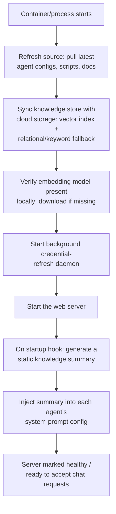
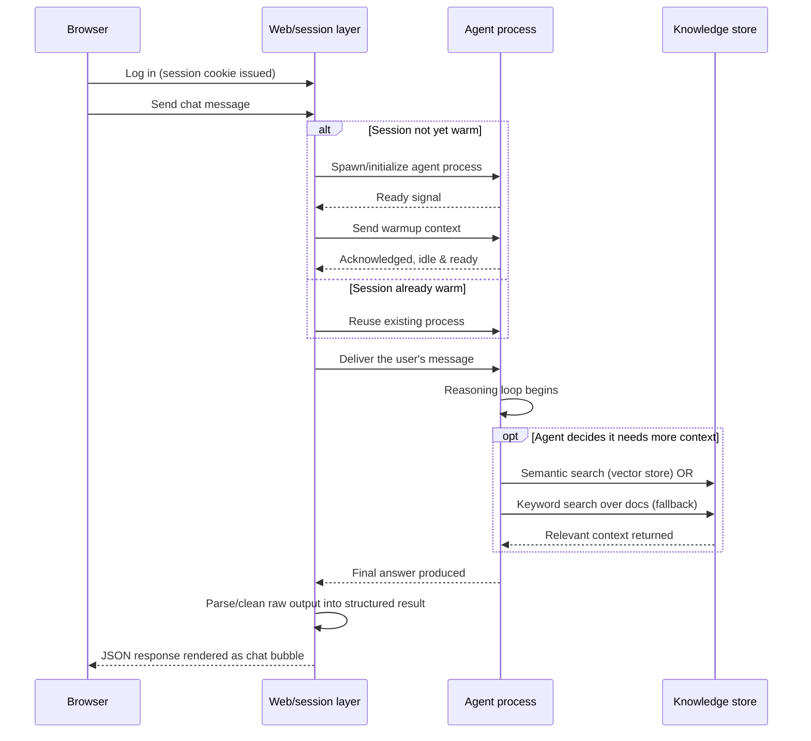

# AI Agent Web Platform -- Serving an Agent Through a Browser

Doc 06 covered the *deployment* agent's tool-calling/approval-gate design.
This doc covers the other half: the actual **serving platform** I built to
expose an AI agent through a browser-based chat UI, reliably, across many
concurrent users -- boot lifecycle, session/process management, and a
two-tier knowledge-retrieval strategy. This is written at the architecture
level, in generic terms, as a reference pattern rather than a literal
description of any single deployed system.

## Why this is its own layer

An LLM agent that can call tools is only half the story once you put it
behind a web UI for a team to use. You also need to solve, generically:

- **Cold start cost.** Spinning up a fresh agent process/session per
  message is slow and wasteful. Reusing a warm, already-initialized agent
  process across a user's conversation turns is much cheaper -- but then
  you need session affinity and a way to detect "is this session already
  warm?"
- **Knowledge freshness vs. latency.** Some context (persona, capabilities,
  a rough summary of what the agent knows) is cheap to bake in once at
  boot. Other context (semantic answers to *this specific* question) only
  makes sense to fetch live, per turn, and only when the agent itself
  decides it's needed.
- **Config as the interface between "platform" and "agent behavior."** The
  people tuning agent behavior day to day usually aren't the people
  maintaining the serving infrastructure -- so agent identity, allowed
  tools, and guardrails belong in a reviewable config file, not hardcoded
  into the server.

## Boot lifecycle

The important design decision here: the startup-time knowledge summary is
a **one-shot, static text blob** baked into the agent's system prompt
config before any user connects. It does not query the vector store live
-- it's a cheap, always-available fallback so a cold conversation has
*some* grounding even before the agent makes its first tool call.

## A chat turn: cold start vs. warm reuse

Two failure-handling details worth calling out generically:

- **Idle vs. hard timeouts.** A "warm" session still needs two timeout
  tiers: a shorter idle timeout (nothing's happened in a while, but the
  agent might just be thinking) and a longer hard deadline (something is
  actually stuck -- give up and surface an error rather than hang
  indefinitely).
- **Output parsing has to be defensive.** If the agent process is a
  terminal-based/CLI tool wrapped by the web layer, its output has to be
  scraped and cleaned (strip control codes, resolve overwritten status
  lines, cut boilerplate) before it's presentable JSON. This is exactly
  the kind of glue code that gets simpler with a framework built for
  structured agent output -- see the Pydantic AI note below.

## Static injection vs. dynamic retrieval -- don't conflate them

| | Static injection (boot-time) | Dynamic retrieval (per-turn) |
|---|---|---|
| **When** | Once, at server startup | On-demand, mid-conversation, agent's own choice |
| **Source** | A lightweight relational/keyword summary | Vector-store semantic search (primary) or doc-file keyword search (fallback) |
| **Where it lands** | Baked into the agent's system-prompt config | Returned as a tool-call result inside that turn |
| **Refresh cadence** | Every server/process restart | Every time the agent decides it's needed |
| **Cost** | Cheap, always available | Slightly more expensive, but current and specific |

Treating these as one thing is a common design mistake -- it either makes
boot painfully slow (querying a vector store for every persona at startup)
or makes every single turn pay a knowledge-retrieval tax even for
questions that don't need it. Splitting them lets each optimize for its
own constraint.

## Agent configuration pattern

Each agent "persona" is defined by a config file, not hardcoded server
logic: identity/role, which tools it's allowed to call, guardrails
(approval gates, rate limits), and a pointer to its knowledge index. This
keeps two audiences cleanly separated:

- **Platform engineers** own the serving layer (session management,
  timeouts, process lifecycle) and rarely need to touch it.
- **Agent owners** iterate on behavior by editing a reviewable config/doc
  file -- no redeploy of the serving platform required for most changes.

## Task/skill organization

Rather than loading every capability into the agent's context up front
(expensive, and most of it irrelevant to any given conversation), tasks
and skills are organized as a **discoverable catalog**: a short directory
of what's available (name + one-line description), loaded fully into
context only when the agent decides a specific skill is relevant. This
keeps the baseline context budget small while still giving the agent
access to a large capability surface on demand.

## Modernization note: Pydantic AI

A terminal-wrapped, screen-scraped agent process (spawn a CLI tool in a
pseudo-terminal, watch for prompt markers, strip ANSI codes from its
output) is a reasonable way to bootstrap an agent platform quickly on top
of an existing CLI-based coding agent. But it carries real complexity: a
lot of the "hard" code in a system like this is really just **defensively
parsing terminal output that was never meant to be machine-readable.**

[Pydantic AI](https://ai.pydantic.dev/) is a good example of where this
category of tooling is heading: a Python agent framework, built by the
Pydantic team, that treats structured input/output as a first-class
citizen instead of an afterthought:

- **Typed outputs** -- define a Pydantic model as the expected response
  shape, and the framework validates/coerces the model's output into it,
  instead of you regex-parsing free text out of a terminal buffer.
- **Model-agnostic** -- swap between OpenAI, Anthropic, Gemini, local
  models, etc., behind one interface.
- **Native dependency injection for tools** -- tools declare what context/
  clients they need (a DB session, an HTTP client, credentials) and the
  framework wires it in, which makes tool functions plain, testable Python
  rather than closures reaching into global state.
- **Streaming and sync/async support** built in, so a chat UI can render
  partial output without hand-rolled buffering logic.

The practical implication for a platform like the one described above: a
lot of the "clean the raw output, detect the prompt banner, debounce false
positives" logic exists purely because the agent's output arrives as
unstructured terminal text. Rebuilding the agent-process layer on a
framework like Pydantic AI would collapse that entire parsing step into a
typed function return value -- the same reasoning loop and tool-calling
model, with the fragile string-scraping layer removed entirely.
